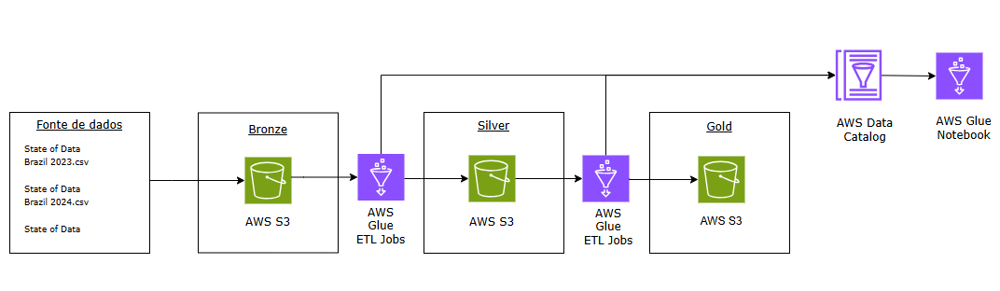

# Pipeline AWS - State of Data
> Pipeline de dados em nuvem, baseada no Amazon Web Services (AWS) para analisar o histórico dos últimos 3 anos da pesquisa State of Data Brazil (2023-2025).

AWS S3 · AWS Glue ETL Jobs · AWS Glue Data Catalog · AWS Glue Notebook · PySpark 
 
## Sobre o projeto

O objetivo do projeto é construir uma pipeline de dados em nuvem, baseada no Amazon Web Services (AWS) para analisar o histórico dos últimos 3 anos da State of Data Brazil (2023-2025), pesquisa realizada anualmente pela Data Hackers em parceria com a Bain & Company. 

Essa pipeline, realiza a ingestão dos dados no serviço AWS S3, sua transformação entre as camadas de uma arquitetura medalhão através do AWS Glue Jobs e a catalogação com o AWS Data Catalog, que disponibiliza a informação para o consumo analítico no AWS Glue Notebook, onde a biblioteca PySpark é utilizada.

## Estrutura do repositório

## Diagrama da arquitetura

## Serviços AWS

| Componente | Descrição |
|---|---|
| AWS S3 | `state-of-data-<ID>` (us-east-1) — armazena as camadas bronze, silver e gold |
| Glue ETL Jobs | `bronze_to_silver` e `silver_to_gold` (PySpark) |
| Glue Data Catalog | `db_silver` (1 tabela) e `db_gold` (5 tabelas) |
| AWS Glue Notebook | `state_of_data_brasil_analise` (PySpark) |

## Arquitetura medalhão

### Camada bronze

A fonte de dados da pipeline são 3 arquivos .csv das últimas edições da pesquisa State Of Data (2023-2025), cuja ingestão no bucket bronze do AWS S3 ocorre manualmente.

### Camada Silver

As 3 fontes de dados possuem diferenças de schema, devido ás mudanças que a pesquisa sofreu ao longo dos anos. Diante disso, o objetivo dessa camada é padronizar o schema para permitir o UNION, resultando na `tb_silver`, uma fonte única de dados limpos.

ETL JOB (`bronze_to_silver`):
1. Padronização de schema:
- Padronização do cabeçalho: formato snake_case, letras minúsculas e sem caracteres especiais.
- Padronização das respostas que sofreram alterações ortográficas, mas que representam o mesmo conteúdo entre os anos.
- Criação de colunas que foram implementadas em anos posteriores.
- Ordenação alfabética das colunas.
2. Remoção de linhas com tokens duplicados.
3. Criação da coluna ano_pesquisa.
4. União dos dados de 2023,2024 e 2025 e um único dataframe.
5. Armazenamento do resultado em Parquet no bucket silver (S3) e registro da tabela `tb_silver` no `db_silver`, utilizando o AWS Glue Data Catalog.

> [Script completo](src/bronze_to_silver.py)

### Camada Gold

A `tb_silver` possui 420 colunas. Dessa forma, o objetivo da camada gold é organizar o dataframe em tabelas temáticas orientadas às principais dimensões analíticas da pesquisa, mantendo o `token` como identificador único do respondente e o `ano_pesquisa` como referência temporal.

ETL JOB (`bronze_to_silver`):
1. Criação das 5 colunas analíticas: `tb_gold_pessoa` | `tb_gold_empresa_atual` | `tb_gold_rotina_profissional` | `tb_gold_ia` | `tb_gold_stack_tecnologico`
2. Armazenamento do resultado em Parquet no bucket gold (S3) e registro das tabelas no  `db_gold`, utilizando o AWS Glue Data Catalog

> [Script completo](src/silver_to_gold.py)

## Análise em PySpark

## Como reproduzir 

